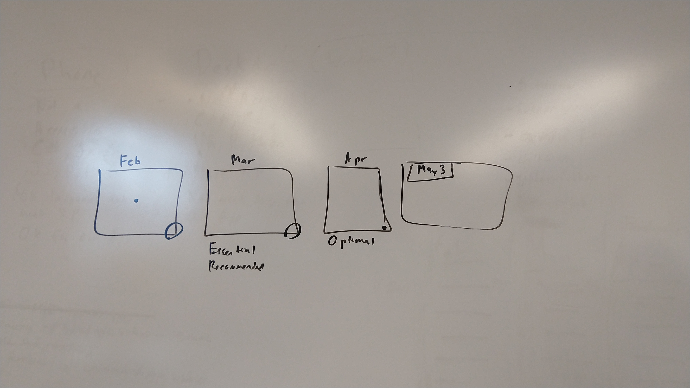
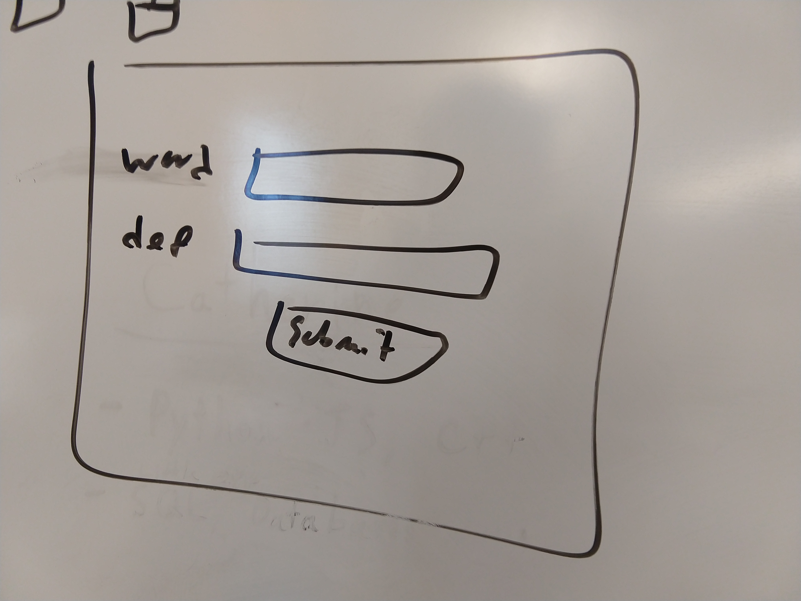

+JMJ+

## Meeting 4: February 9, 2021

1. Review Meeting Plan
   - Anything else we should add?
2. Go over what we did last week
4. Things to do this week
   - Documentation:
     - Final Project Plan
     - Final Project Requirements
       - Details on Phone OS
       - Documentation and Delivery Standards
     - Draft Project Architecture
     - Figure out how to use: GitHub Wiki, Google Forms
   - Things to learn:
     - Accounts (*Security!*)
     - How to distribute app to test users
     - Word filter
     - Code Maintenance: naming conventions, etc
     - Analasis Models?
     - Project Architecture
   - Start Coding (write prototype this week and next week):
     - U.I
     - Interact with Database
     - (maybe a very basic filter?)
5. Homework:
   - **Chris**: SQL, Connect to DB, Code Conventions, Initialize repository
   - **Ben**: Project Requirements, Project Architecture, Accounts
   - **Margs**: Project Plan, how to distribute apps
   - **Catherine**: Initialize Repository, Word Filter, Prototype Screens

## Pictures

### Calendar

Here is a basic view of our schedule over the entire project.

**February**: learn stuff, make a basic app 
**March**: add essential and recommended requirements 
**April**: work on optional requirements 

### Architecture

Here is an idea of the architecture model we're planning to use. The app is managed by one function that executes sub-routines, which have more subroutines...

### Basic UI

Here's an idea of what the UI for our basic app would be like at the end of the month.

